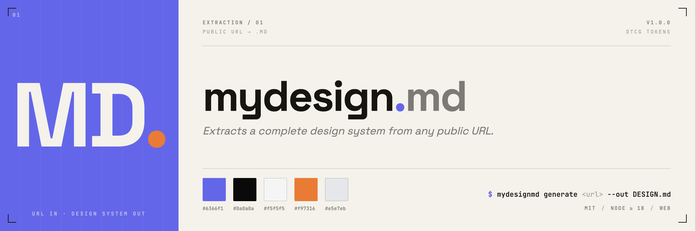

**Extract a complete design system from any live website URL.**

Paste a public URL → get back a structured `DESIGN.md`, `design-tokens.json` (W3C DTCG), CSS custom properties, Tailwind v4 config, and a design audit report. No install. No Figma access required.

[](https://www.npmjs.com/package/mydesignmd)
[](https://opensource.org/licenses/MIT)
[](https://www.mydesignmd.com)

---

## Why this exists

[awesome-design-md](https://github.com/VoltAgent/awesome-design-md) curates high-quality `DESIGN.md` files for well-known brands. If the site you need is Stripe or Linear, you're covered. If it isn't — you're on your own.

MYDESIGN.MD makes that output available for **any public URL, on demand**. Same quality bar. No waiting for someone to manually curate the brand you actually need.

→ **[Generate a DESIGN.md for any URL at mydesignmd.com](https://www.mydesignmd.com)**

---

## Extracted design systems

### AI & Developer Platforms
- [Anthropic](https://www.mydesignmd.com/jobs/job_6543b2416f2046398b2a357b) — anthropic.com
- [Cursor](https://www.mydesignmd.com/jobs/job_53d7578655af4127b9e4a54f) — cursor.com
- [ElevenLabs](https://www.mydesignmd.com/jobs/job_f579f87c86644a0d9c3530d2) — elevenlabs.io
- [Hume AI](https://www.mydesignmd.com/jobs/job_cd37d56506f94870bc6f2dce) — hume.ai
- [Microsoft AI](https://www.mydesignmd.com/jobs/job_e21a46b910db45e89f281d22) — microsoft.ai
- [Modal](https://www.mydesignmd.com/jobs/job_57fabf7100324ea599996473) — modal.com
- [Replit](https://www.mydesignmd.com/jobs/job_75f8c5d6c4724052903633c6) — replit.com
- [Supabase](https://www.mydesignmd.com/jobs/job_40fd96b297b3422aa38ca9e0) — supabase.com

### Crypto & Web3
- [Caldera](https://www.mydesignmd.com/jobs/job_93f19505088b42a483bd4d75) — caldera.xyz

### Health & Fitness
- [Whoop](https://www.mydesignmd.com/jobs/job_09c4e9ccc74146598ba28995) — whoop.com

### Lifestyle & Retail
- [Le Labo Fragrances](https://www.mydesignmd.com/jobs/job_43af7b13d494421bbf55de5f) — lelabofragrances.com

### Media & Publishing
- [Medium](https://www.mydesignmd.com/jobs/job_058aaa377e7f434dbb400cb0) — medium.com

---

## What each output contains

Every extraction returns a full design system package:

| Artifact | Format | Contents |
|---|---|---|
| `DESIGN.md` | Markdown | Colors, typography, spacing, components, design rationale |
| `design-tokens.json` | W3C DTCG | Machine-readable token map for Style Dictionary, Tokens Studio |
| `variables.css` | CSS | Custom properties, ready to drop into any stylesheet |
| `tailwind.config.js` | JS | Tailwind v4 `@theme` block |
| `audit.md` | Markdown | Inconsistencies in the source CSS |

---

## Generate your own

Any public URL → full design system package in a few minutes.

**Web:** [mydesignmd.com](https://www.mydesignmd.com) — no install required

**CLI:**
```bash
npx mydesignmd extract https://your-site.com
```

**API:**
```bash
curl -X POST https://api.mydesignmd.com/v1/extract \
  -H "Authorization: Bearer YOUR_KEY" \
  -H "Content-Type: application/json" \
  -d '{"url": "https://your-site.com"}'
```

---

## Use with AI coding agents

`DESIGN.md` is plain markdown — every major AI coding agent can load it as persistent context.

| Agent | Where to add |
|---|---|
| **Claude Code** | `@DESIGN.md` in `CLAUDE.md` |
| **OpenAI Codex** | `@DESIGN.md` in `AGENTS.md` |
| **Cursor** | `.cursor/rules/design-tokens.mdc` |
| **GitHub Copilot** | `.github/copilot-instructions.md` |
| **Windsurf** | `.windsurfrules` |

Full setup guide → [design-tokens-for-ai-coding-agents](https://www.mydesignmd.com/design-tokens-for-ai-coding-agents)

---

## Honest limitations

- **Login-gated sites** — the extractor sees what an unauthenticated browser sees
- **Production drift** — output reflects shipped CSS, not Figma intent. Usually this is what you want.
- **No rationale extraction** — the "why" is inferred from visual evidence; review it with your team
- **Heavy JS interaction** — sites that require user interaction before rendering may produce incomplete output

---

## Related

- [What is a DESIGN.md file?](https://www.mydesignmd.com/what-is-design-md)
- [How to extract a design system from any website](https://www.mydesignmd.com/how-to-extract-a-design-system-from-any-website)
- [Design tokens for AI coding agents](https://www.mydesignmd.com/design-tokens-for-ai-coding-agents)
- [awesome-design-md](https://github.com/VoltAgent/awesome-design-md) — curated collection of hand-crafted DESIGN.md files

---

MIT License
